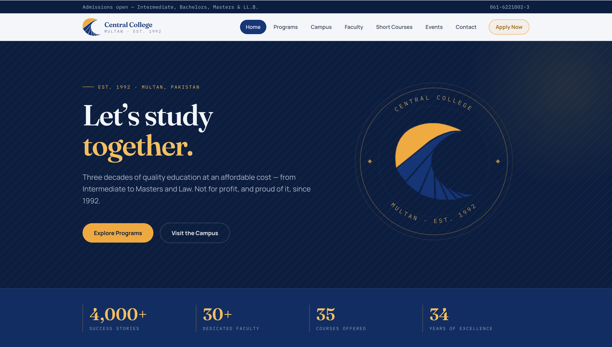

# Central College Multan — Website

A website for **Central College Multan**, a not-for-profit institution offering
quality education from Intermediate to Masters and Law since 1992.

**Live:** [centralcollege.aqeelahmed.dev](https://centralcollege.aqeelahmed.dev)



> **University project.** Built by **Aqeel Ahmed** as part of a BSIT final-year
> project, alongside the companion
> [eLibrary Management System](https://github.com/themagician-x/eLibrary-Management-Syestem-for-Central-College-Multan).
> It is not the college's official web presence, and the figures shown on it
> are illustrative.

Built with **Next.js 16** (App Router) and **Tailwind CSS v4**, deployed on
**Vercel**.

## Pages

| Page | Contents |
|---|---|
| **Home** | Hero, live counters, programs, Law College, campus life |
| **Programs** | Intermediate, Bachelors, Masters, and LL.B. |
| **Campus** | College story, Central Law College, admission FAQs |
| **Faculty** | Leadership, teaching faculty, and support staff |
| **Short Courses** | Professional e-learn courses |
| **Events** | Campus life and the academic year |
| **Contact** | Address, opening hours, and one-tap call, email and directions |

## Design

Brand palette — navy `#06377b` and marigold `#faa61a`, both drawn from the
college logo. Typography is Fraunces for display, Manrope for body text, and
IBM Plex Mono for labels.

The hero sets the college mark into a seal, with the name and founding year
carried around it — the mark alone would only have repeated the navbar.

Responsive down to 320px and verified there: no page overflows its viewport at
any width, and no layout stretches the viewport to fit itself. Interactive
targets meet the 24px minimum in WCAG 2.5.8, apart from links inline in a
sentence, which the guideline exempts.

## Getting started

```bash
npm install
npm run dev        # http://localhost:3000
```

## Scripts

```bash
npm run build      # production build
npm run start      # serve the production build
npm run lint       # eslint
node scripts/responsive-check.mjs   # verify no horizontal overflow (dev server running)
```

## Deploying

A standard Next.js deployment on Vercel. **The site needs no secrets.** The one
variable is `NEXT_PUBLIC_SITE_URL` — the public origin, e.g.
`https://centralcollege.aqeelahmed.dev` — and it is only needed once a custom
domain sits in front of the deployment. Without it the app falls back to the
URL Vercel assigns, so `*.vercel.app` works untouched.

That single value feeds `metadataBase`, the canonical link, `robots.txt` and
`sitemap.xml`, so setting it is what points shared links and search listings at
the real domain rather than the deployment URL. It is read at build time, so
add it and then **redeploy** — a restart alone will not pick it up.

## Author

**Aqeel Ahmed** — BSIT final-year project, 2026.
